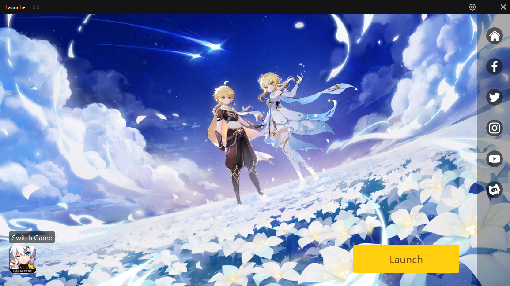

# miHoYo Launcher >> HoyoLauncher

## What is this?

* This is a custom launcher for Honkai Impact 3rd and Genshin Impact written in Python + PySide6 (Python bindings for Qt6).  

* This project is a rebuilt project from [HoyoLauncher](https://github.com/gablm/hoyolauncher) and [miHoYo Launcher](https://github.com/shirooo39/mihoyo_launcher).  

## What's changed?

* Remove Honkai: Star Rail from HoyoLauncher.
* Change Genshin background.

## Download

* This is 
## Working with the source code

There are some requirements you'd need to pay attention to:
1. Python 3.11
2. PySide6 (pip install PySide6)

## License

Probably still within MIT License?
